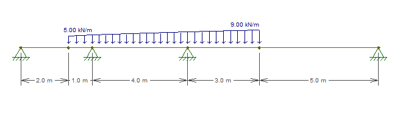

# BeamsJS

BeamsJS let us create isostatic and hyperstatic continuous beams with vertical-fixed supports, and access the resulting reactions, shear force and bending moments.

## Setting up
### Instalation
  `npm install beamsjs`

### Importing and using
  ```ts
    // One line for importing
    import { Beam, Node, DistributedLoad } from beamsjs
    
    // One-line for creating the beam
    const beam = new Beam(createFixNodes(0,2,4), [new DistributedLoad(12)])

    // Once created, the properties are easily accessible
    beam.reactions            // Access the beam reactions
    beam.shearForce(1.999)    // Returns the shear force on x = 1.999
    beam.bendingMoment(0.75)  // Returns the value 3.375
  ```

---

## Usage Exemple
### A simple, hyperstatic beam  
- The example above can be graphically represented by the following image:<br>


- It was created as follows:
  ```ts
    const beam = new Beam(
      Node.createFixNodes(0,2,4),
      [new DistributedLoad(12)]
    )
  ```

- Once the beam instance is created, the properties can be accessed by the  properties and methods of the object:
  ```ts
    beam.reactions          // Returns the array [9, 30, -9]
    beam.shearForce(1.999)  // Returns the value -14.988 (almost -15)
    beam.shearForce(2.001)  // Returns the value 14.988 (almost 15) 
  ```
  

  ```ts
    beam.bendingMoment(0.75)  // Returns the value 3.375
    beam.bendingMoment(2)  // Returns the value -6.000
    beam.beandingMoment(4)               // Returns the value 0  
  ```
  

---

### A more complex example
- Lets build a more complex beam with a non-uniform distributed load, a punctual load and overhang ends:
  ```ts
    /* Create a distributed trapezoidal load passing as parameters:
        - the start value of the load
        - the end value value of the load
        - the start x-coordinate of the load
        - the end x-coordinate of the load
      Optionally, we can just past a single value, in case of a uniform load acting on all the beam
    */
    const distLoad = new DistributedLoad(5,9,2,10)
    
    /* For punctual loads, we pass as atributes:
      - the value of the punctual load,
      - the x-coordinate of the punctual load
    */
    const punctualLoad = new PunctualLoad(13,10)

    /* Create the nodes with their support status, with the parameters as following:
        - the x-coordinate of the node,
        - the y-direction situation of the of the node, ie. true if it is fixed, false if it is a cantilever end
      Important to note that only the first and last nodes of the beam can be not fixed.
      For cantilever beams, we still have to create the first and last nodes and give them false as the second parameter where they are free
      Optionally, we can create fixed nodes passing only the first parameter
      On beams without cantilever ends, we can use the static method:
        - const nodes = Node.createFixNodes([0, 3, 7, 15])
    */
    const nodes = [
      new Node(0, false),
      new Node(3, true),
      new Node(7, true),
      new Node(15, false)
    ]

    /* Finally, we can create the beam, passing as parameters:
      - an array with the nodes created above,
      - an array with all the distributed loads created above
      - an optional array with all punctual loads created above,
      - the optional value of the constant EI, the product of inertia moment and Young's modulus
    */
    const beam = new Beam(nodes, [distLoad], [punctualLoad])
  ```

  which is equivalent to:<br>
  

--- 

## Running Tests
- For testing in a command-line environment:
  - Clone this repo to a local directory
  - Run `npm install` inside the newly created directory to install the node modules 
  - Run `npm test`

## Current Tests Status


---

## Version history

#### 1.0.2
  - 📄 Fixed problem with multiple overlapping distributed loads
- **TODO:** Format, prettify and optimize the code

#### 1.0.1
  - 📄 Readme and documentation updated
- **TODO:** Format, prettify and optimize the code

#### 1.0.0
- Configurations for publishing done
- Documentation and examples in this readme file

#### 0.1.4
- 🥇 Hyperstatic beams with overhang ends, punctual loads and trapezoidal loads working all working united 
- 🚀 Features ready to publish!
- **TODO:** Add documentation and user interface

#### 0.1.3
- Aug 24th, 2022
- Isostatic beam with punctual load tested and passing 
- **TODO:** Add distributed trapezoidal loads

#### 0.1.2
- Aug 22th, 2022
- Beam with overhang on both tested and working
- **TODO:** Add test and calculations for punctual loads

#### 0.1.1
- Aug 20th, 2022
- Included tests for a isostatic beam and a longer, 3-gaps hyperstatic beam 
- Fixed a wrong sign on the main moments matrix calculation
- **TODO:** Test for beams with overhang ends 

#### 0.1.0
- Aug 19th, 2022
- Structural model for calculating reactions, shear forces and bending moments in rotation-free beams
- Tested for hyperstatic beams only
- **TODO:** Includes overhang ends and isostatic beams (1 gap and 2 single supports)