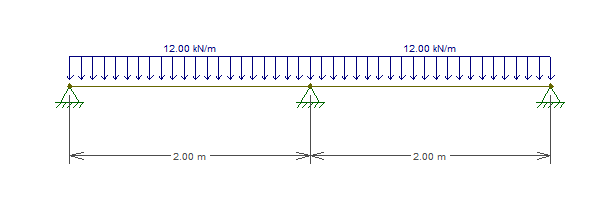
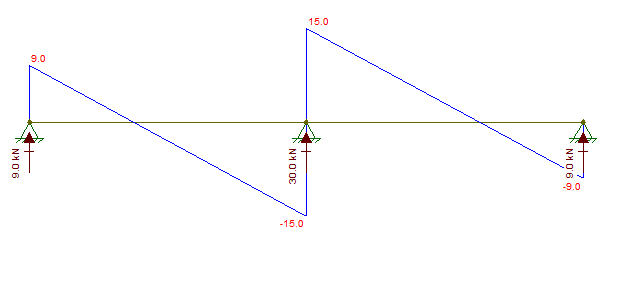
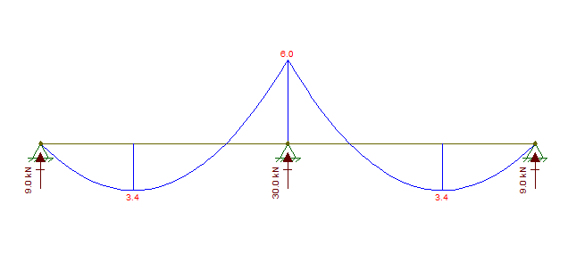
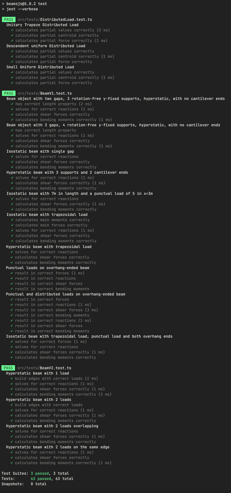

# BeamsJS
V 1.0.0

BeamsJS let us create isostatic and hyperstatic continuous beams with vertical-fixed supports, and access the resulting reactions, shear force and bending moments.

## Usage Exemple
- The following beam:


- can be created as follows:
  ```ts
    const beam = new Beam(
      createFixNodes(0,2,4),
      [new DistributedLoad(12)]
    )
  ```

- Once the beam instance is created, their properties can be accessed by the inner properties and methods of the object:
  ```ts
    beam.reactions          // Returns the array [9, 15, -9]
    beam.shearForce(1.999)  // Returns the value -14.988 (almost -15)
    beam.shearForce(2.001)  // Returns the value 14.988 (almost 15) 
  ```
  

  ```ts
    beam.bendingMoment(0.75)  // Returns the value 3.375
    beam.bendingMoment(2)  // Returns the value -6.000
    beam.(4)               // Returns the value 0  
  ```
  

- It is possible to create new Beam instances with the following pattern:
  ```ts
    const distLoad = new DistributedLoad(5,9,2,10)
    const punctualLoad = new PunctualLoad(13,10)
    const nodes = [
      new Node(0, false),
      new Node(3),
      new Node(7),
      new Node(15, false)
    ]
    const beam = new Beam(nodes, [distLoad], [punctualLoad])
  ```

## Running Tests
- For testing in a command-line environment:
  - Clone this repo to a local directory
  - Run `npm install` inside the newly created directory to install the node modules 
  - Run `npm test`

## Current Tests Status


## Version history

#### 1.0.0
- Configurations for publishing done
- Documentation and examples in this readme file
- **TODO:** Format, prettify and optimize the code

#### 0.1.4
- 🥇 Hyperstatic beams with overhang ends, punctual loads and trapezoidal loads working all working united 
- 🚀 Features ready to publish!
- **TODO:** Add documentation and user interface

#### 0.1.3
- Aug 24th, 2022
- Isostatic beam with punctual load tested and passing 
- **TODO:** Add distributed trapezoidal loads

#### 0.1.2
- Aug 22th, 2022
- Beam with overhang on both tested and working
- **TODO:** Add test and calculations for punctual loads

#### 0.1.1
- Aug 20th, 2022
- Included tests for a isostatic beam and a longer, 3-gaps hyperstatic beam 
- Fixed a wrong sign on the main moments matrix calculation
- **TODO:** Test for beams with overhang ends 

#### 0.1.0
- Aug 19th, 2022
- Structural model for calculating reactions, shear forces and bending moments in rotation-free beams
- Tested for hyperstatic beams only
- **TODO:** Includes overhang ends and isostatic beams (1 gap and 2 single supports)
