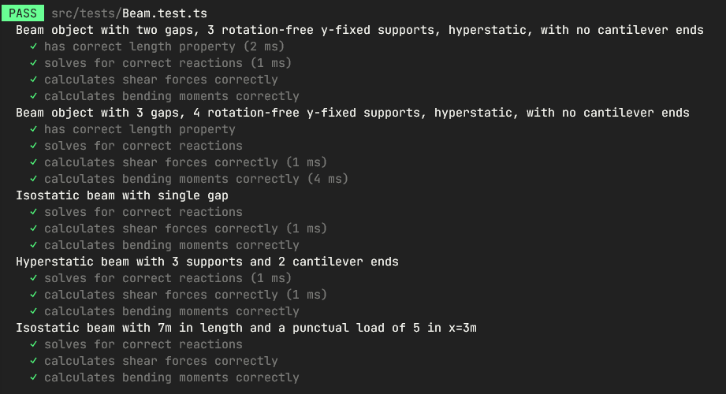

# BeamsJS
Current version 0.1.4

## Running
- For testing in a command-line environment:
  - Clone this repo to a local directory
  - Run `npm install` inside the newly created directory to install the node modules 
  - Run `npm test`

## Current Tests Status

## Version history

#### 0.1.4
- 🥇 Hyperstatic beams with cantilevers-ends, punctual loads and trapezoidal loads working all working united 
- 🚀 Features ready to publish!
- **TODO:** Add documentation and user interface

#### 0.1.3
- Aug 24th, 2022
- Isostatic beam with punctual load tested and passing 
- **TODO:** Add distributed trapezoidal loads

#### 0.1.2
- Aug 22th, 2022
- Beam with cantilever on both tested and working
- **TODO:** Add test and calculations for punctual loads

#### 0.1.1
- Aug 20th, 2022
- Included tests for a isostatic beam and a longer, 3-gaps hyperstatic beam 
- Fixed a wrong sign on the main moments matrix calculation
- **TODO:** Test for beams with cantilever ends 

#### 0.1.0
- Aug 19th, 2022
- Structural model for calculating reactions, shear forces and bending moments in rotation-free beams
- Tested for hyperstatic beams only
- **TODO:** Includes cantilever ends and isostatic beams (1 gap and 2 single supports)
